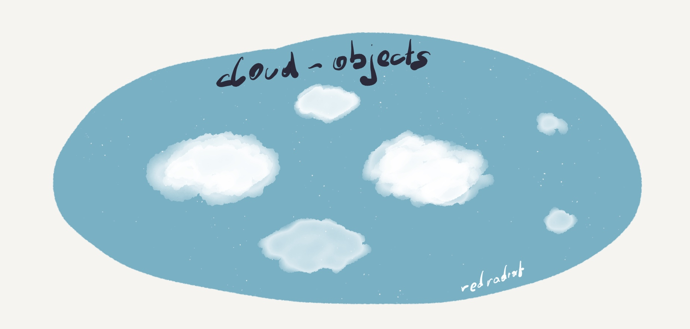

# cloud-objects
Generic Cloud Service Object C(R)UD Representation

This repository hosts a generic abstraction of Cloud Service Objects into golang CRUD instances.

Currently following Objects are implemented:

**AWS**

| Amazon Web Service | Supported | Resources |
| --- | --- | --- |
| IAM | Partially | Policy, PolicyAttachment, Role |
